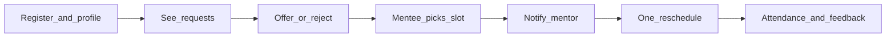

# Mentor flow: spec vs implemented

The spec’s Mentor Flow is [docs/mvp-plan/spec.md](docs/mvp-plan/spec.md) steps 1–6, plus the “Mentors can” bullets and the scheduling rules that apply to mentors.

## Implemented

- **Register as mentor** through the register dialog, with name, email, password, stack, job/workplace, years, background, topics, capacity, and duration ([client/src/components/RegisterDialog.jsx](client/src/components/RegisterDialog.jsx)).
- **Edit mentor profile** for those same fields (plus GitHub/LinkedIn) ([client/src/components/ProfilePage.jsx](client/src/components/ProfilePage.jsx)).
- **See incoming requests**, **reject**, and **offer future slots** ([client/src/components/MentorMeetingsPage.jsx](client/src/components/MentorMeetingsPage.jsx), [server/services/mentoringRequestsService.js](server/services/mentoringRequestsService.js)).
- **Track scheduled / completed meetings** (tabs on the mentor meetings page).
- Extra-times round when the mentee declines the first offer (spec scheduling rule, mentee-triggered; mentor then offers a second set).

## Not implemented (mentor flow)

These are the spec mentor steps / mentor-owned fields that are still missing:

1. **Online meeting link (required)**
  Spec step 2 and “Offered slots must be in the future / Online meeting link is required.” There is **no `meetingLink` field** in Prisma, registration, or profile edit. Meetings have no link to share.
2. **Optional profile photo**
  Spec lists optional photo. `profileImageUrl` exists on `User` and in i18n labels, but **register and mentor profile edit do not collect it**.
3. **Notify mentor when a mentee chooses a slot** (spec step 5)
  Inbox today only shows “needs new times” and “closed after second decline.” There is **no `MEETING_MATCHED` notification**. The mentee **cannot choose a slot yet** (`onChooseTime` is still “coming soon” in [client/src/components/MenteeMeetingsPage.jsx](client/src/components/MenteeMeetingsPage.jsx)). Until that exists, step 5 cannot happen.
4. **Mentor requests one reschedule after match** (spec step 6)
  No reschedule API, UI, or `RESCHEDULE_*` round usage. Upcoming cards have no “שינוי מועד”. Schema allows `RESCHEDULE_BEFORE_MEETING`; it is unused.

##  also missing

Not numbered in the Mentor Flow list, but they are mentor responsibilities in the same spec:

- **Capacity enforcement** — `meetingCapacity` is stored and editable, **never checked** when offering slots or matching. Spec: “Mentor capacity is enforced using active plus completed meetings.”
- **Attendance confirmation** — mentor should confirm whether the meeting happened. Schema has `AttendanceConfirmation` / `MeetingOutcomeConfirmation`; no mentor UI or API.
- **Feedback** — spec regular-user + post-meeting follow-up; mentor has no feedback form.
- **Mentor home** — `/mentor` is still the placeholder [client/src/components/RoleAreaPage.jsx](client/src/components/RoleAreaPage.jsx) (“עמוד בסיסי…”). Real work lives only under `/mentor/meetings` and `/profile`.

Filled in today: register, inbox, offer/reject. Broken/unbuilt: match, notify-on-match, reschedule, meeting link, photo, capacity, attendance, feedback.

## Already out of MVP (do not treat as mentor-flow gaps)

WhatsApp reminders, email automation, calendar sync — listed as non-goals in [docs/mvp-plan/intent.md](docs/mvp-plan/intent.md).