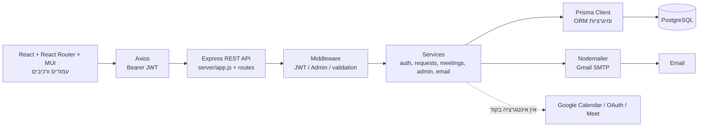
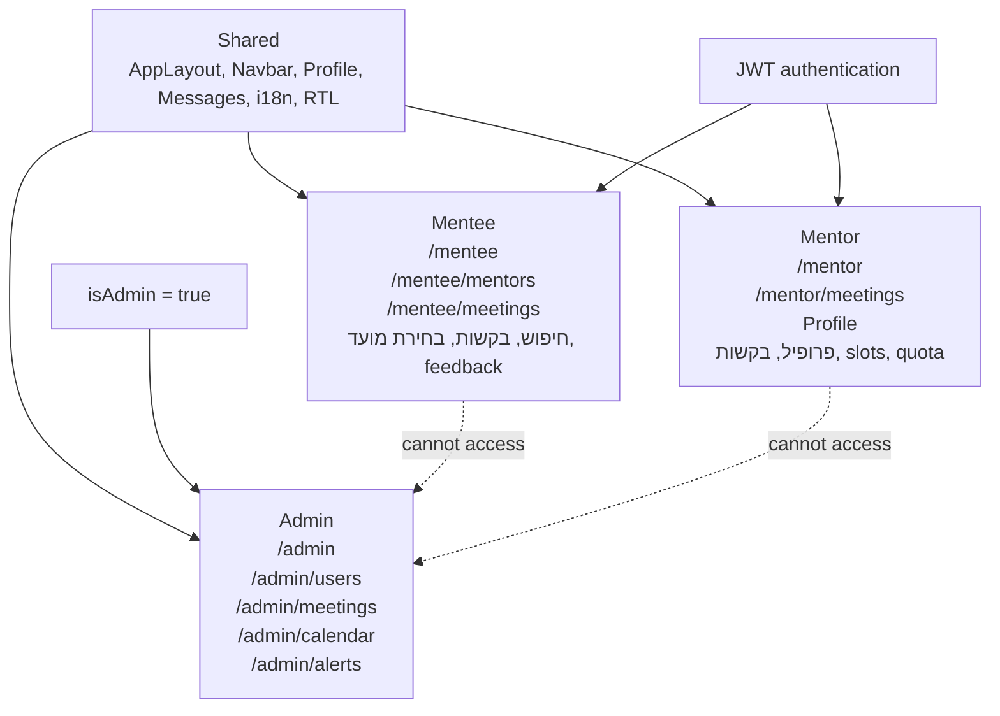
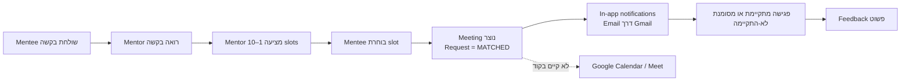
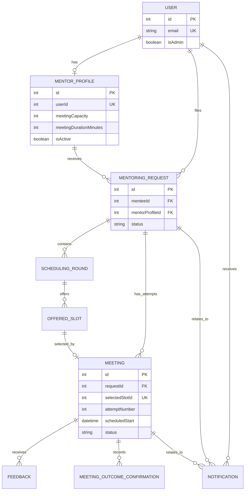
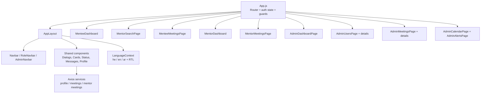

# Queens Match — מדריך להצגת הפרויקט

מסמך הכנה להצגה, המבוסס על הקוד והקבצים שנמצאים בריפוזיטורי. כאשר יש פער בין מסמך תכנון לבין הקוד בפועל, הקוד הוא הקובע; הפער מסומן במפורש.

## 1. הסיפור במשפט אחד

Queens Match היא אפליקציית MVP שמחברת בין mentee-יות לבין mentor-יות: המשתמשת מחפשת מנטורית, שולחת בקשה, המנטורית מציעה מועדים, המשתמשת בוחרת מועד, ולאחר מכן אפשר לנהל את הפגישה, לאשר אם התקיימה ולתת משוב. מנהלת המערכת מקבלת תמונת מצב תפעולית של משתמשות, פגישות והתראות.

## 2. מה קיים בפועל ומה לא

### מומש בקוד

- הרשמה והתחברות, עם סיסמה מוצפנת ב־bcrypt ו־JWT בתוקף 7 ימים.
- פרופיל משתמשת ופרופיל מנטורית, כולל רקע, תפקיד, מקום עבודה, ניסיון, טכנולוגיות, נושאי mentoring, מכסה ומשך פגישה.
- חיפוש מנטוריות פעילות, סינון לפי `jobTitle`, `workplace` ו־`topic`, ומיון לפי שם.
- בקשת mentoring, דחייה, הצעת 1–10 מועדים עתידיים, בקשת מועדים נוספים פעם אחת ובחירת מועד.
- יצירת פגישה, מניעת פגישה פעילה נוספת למנטורית/mentee, מכסה חודשית, ביטול ובקשת reschedule פעם אחת.
- אישור תוצאת פגישה אחרי מועד הסיום ומשוב פשוט של דירוג 1–5 וטקסט.
- התראות in-app ודוא״ל עבור בקשות, הצעת מועדים, התאמה, reschedule וביטול מנטורית; שליחת דוא״ל דרך Gmail/SMTP.
- אזור admin: summary, analytics לתקופה של 3/6/12 חודשים, משתמשות, פרטי משתמשת, פגישות, סטטוסים, שינוי מועד, ביטול, לוח חודשי והתראות תפעוליות.
- RTL, עברית/אנגלית/ערבית, Material UI, עיצוב responsive למסכים קטנים וגדולים.

### מומש חלקית / חשוב לדייק בהצגה

- `AttendanceConfirmation` קיים בסכמה, אך השירות בפועל כותב `MeetingOutcomeConfirmation` בלבד. לכן לא לטעון שיש מנגנון אישור נוכחות דו־צדדי מלא.
- `FEEDBACK_COMPLETED` קיים כ־enum, אך `submitMeetingFeedback` שומר את המשוב ולא מעדכן בפועל את הסטטוס ל־`FEEDBACK_COMPLETED`.
- ה־analytics הם חישובי backend על בסיס נתוני פגישות/משתמשות; אין גרפים מתקדמים או export CSV.
- ה־calendar הוא לוח פנימי של admin באמצעות FullCalendar. הוא אינו מסונכרן עם שירות calendar חיצוני.
- החיפוש/סינון קיים, אך רק לפי השדות שה־API מממש; אין אלגוריתם matching חכם.

### לא מומש; מופיע רק כתכנון או כמודל

- אין בקוד Google OAuth, Google Calendar API או יצירת Google Meet.
- אין `meetingLink` ב־`schema.prisma`, למרות שהוא מופיע במסמך התכנון הישן `docs/mvp-plan/spec.md`.
- WhatsApp מופיע כ־enum וכרעיון עתידי, אך אין ספק, queue או שליחה בפועל.
- אין reminders מתוזמנים, job queue, refresh tokens, איפוס סיסמה, אימות email או audit log.

## 3. תפקידי המשתמשות והזרימה מקצה לקצה

### Mentee

נרשמת או מתחברת → פותחת את אזור ה־mentee → מחפשת מנטורית פעילה → שולחת בקשה → ממתינה להצעת מועדים → בוחרת מועד או מבקשת מועדים נוספים → רואה פגישה → יכולה לבטל או לבקש reschedule → לאחר הסיום מדווחת אם הפגישה התקיימה ומשאירה משוב.

ראיות: `client/src/components/MenteeDashboard.jsx`, `MentorSearchPage.jsx`, `MenteeMeetingsPage.jsx`, `SelectSlotDialog.jsx`, `FeedbackDialog.jsx`; בצד השרת `server/services/mentoringRequestsService.js` ו־`meetingsService.js`.

### Mentor

נרשמת כמנטורית או יוצרת פרופיל mentor → מעדכנת פרופיל ונושאי mentoring → רואה בקשות נכנסות → דוחה בקשה או מציעה מועדים → יכולה לאשר חריגה ממכסה כשנדרש → רואה פגישות → יכולה לבקש reschedule או לבטל.

ראיות: `ProfilePage.jsx`, `MentorDashboard.jsx`, `MentorMeetingsPage.jsx`, `OfferSlotsDialog.jsx`; בצד השרת `usersService.js`, `mentoringRequestsService.js`, `meetingsService.js`.

### Admin

נכנסת דרך guard של admin → רואה summary ו־analytics → מנהלת משתמשות והרשאות admin → עורכת פרופיל או נראות של מנטורית → מסננת פגישות ומעדכנת סטטוס/מועד → רואה calendar חודשי → מטפלת בהתראות, מקצה אותן ומסמנת resolved.

ראיות: `client/src/components/admin/*`, `server/routes/admin.js`, `server/services/adminService.js`.

### תשתית משותפת

- React Router, `App.js`, guards, `AppLayout`, navbars, theme, RTL ו־i18n.
- רכיבי UI משותפים: dialogs, cards, status cards, menu, feedback, loading/error/empty states.
- Axios/API client, אחסון session ב־`localStorage` ו־Bearer header.
- Express app, middleware, error handling, Prisma client, PostgreSQL schema, migrations ו־seed.
- מודל נתונים וסטטוסים משותפים לכל שלושת האזורים.

## 4. תרשים ארכיטקטורה



המשמעות: פעולה ב־React נשלחת כ־HTTP ל־Express. ה־route בודק קלט ומעביר את העבודה ל־service. ה־service מפעיל כללי עסקיים ו־Prisma קורא/כותב PostgreSQL. דוא״ל הוא חיבור חיצוני קיים; Google Calendar/OAuth/Meet מוצגים כאן כגבול מתוכנן בלבד, לא כחיבור פעיל.

## 5. מפת תפקידים, עמודים והרשאות



ה־frontend מונע ניווט לא מורשה באמצעות `RequireAuth`, `RequireAdmin` ו־`isMentorUser` ב־`client/src/App.js`. השרת מגן על admin עם `requireAuth` ואז `requireAdmin` ב־`server/routes/admin.js`; הרשאת בעלות על בקשה/פגישה נבדקת גם בתוך השירותים.

## 6. זרימת meeting המרכזית



המועד שנבחר הוא `OfferedSlot` שמקושר ל־`Meeting.selectedSlotId`. קיימת היסטוריה של rounds ו־attempts, ולכן reschedule אינו מוחק את ההיסטוריה אלא מסמן את הפגישה הקודמת כ־`RESCHEDULED` ופותח round חדש.

## 7. Sequence: לחיצה על “בחירת מועד”

```mermaid
sequenceDiagram
  actor M as Mentee
  participant R as React
  participant X as Axios
  participant API as Express route
  participant S as meetingsService
  participant DB as Prisma/PostgreSQL
  participant E as Nodemailer/Gmail
  participant G as Google Calendar/Meet

  M->>R: לחיצה על בחירת מועד
  R->>X: POST /api/mentoring-requests/:id/select-slot
  X->>API: Bearer JWT + slotId
  API->>S: selectMentoringRequestSlot(...)
  S->>DB: בודק request, slot, בעלות, פגישה פעילה ומכסה
  S->>DB: transaction: create Meeting + update Request + notification
  DB-->>S: meeting SCHEDULED, request MATCHED
  S->>E: sendMeetingScheduledEmails (best effort)
  E-->>S: הצלחה או שגיאה שנלכדת
  S-->>API: meeting
  API-->>R: HTTP 201
  R-->>M: הפגישה מופיעה כמתוזמנת
  S-->>G: אין קריאה בקוד; Calendar/Meet לא מתעדכנים
```

זהו מקום טוב לומר בכנות: יש עדכון אמיתי של בסיס הנתונים ושל email/in-app notification, אך אין עדכון Google Calendar. השירות משתמש ב־transaction עם `Serializable`, בודק שה־slot הוא מהמועדים האחרונים, שהמועד עתידי ושאין חריגה ממכסה.

## 8. ER diagram מצומצם של Prisma



Prisma הוא ORM: שכבת קוד שמאפשרת לשירותים לעבוד עם מודלים ו־queries במקום לכתוב SQL ידני בכל מקום. Migration היא קובץ שינוי גרסה של הסכמה; כאן המיגרציות תחת `server/prisma/migrations/` בונות ומעדכנות את PostgreSQL. הסכמה מנרמלת topics/technologies, שומרת היסטוריית rounds ו־meeting attempts ומוסיפה אינדקסים לסטטוסים ולתאריכים.

## 9. מבנה ה־frontend



המבנה מפריד בין shell משותף לבין עמודי domain. `App.js` מרכז את ה־routes, אך הלוגיקה של פגישות, בקשות ו־admin נמצאת ברכיבים ובשירותי backend נפרדים.

## 10. טכנולוגיות, ספריות ו־APIs

| טכנולוגיה / ספרייה | תפקיד מדויק בפרויקט | ראיה |
|---|---|---|
| React 18 | בניית מסכים ורכיבים אינטראקטיביים | `client/package.json`, `client/src/` |
| React Router 6 | ניתוב בין אזורי mentee, mentor ו־admin ו־route guards | `client/src/App.js` |
| Material UI + Emotion | רכיבי UI, layout, theme, responsive styling | `client/package.json`, `client/src/theme.js` |
| `stylis-plugin-rtl` | תמיכה בכיוון RTL לעברית ולערבית | `client/src/rtlCache.js`, `theme.js` |
| Axios | שליחת HTTP ל־REST API והוספת Bearer JWT | `client/src/api/client.js`, `client/src/services/` |
| FullCalendar + daygrid | calendar חודשי פנימי ל־admin, עם צבע לפי סטטוס | `AdminCalendarPage.jsx` |
| dayjs | תאריכים ובחירת מועד בצד הלקוח | `client/package.json`, רכיבי dialogs |
| Node.js | runtime לשרת | `server/package.json` |
| Express | routing, middleware ו־REST API | `server/app.js`, `server/routes/` |
| Helmet, CORS, Morgan | headers בסיסיים, cross-origin logging ו־HTTP logging | `server/app.js` |
| Prisma 6.19.3 | ORM, client, schema ו־migrations | `server/prisma/schema.prisma`, `server/lib/prisma.js` |
| PostgreSQL | בסיס הנתונים היחסי של משתמשות, בקשות, slots, meetings, feedback והתראות | `schema.prisma` datasource |
| bcryptjs | hashing של סיסמאות לפני שמירה והשוואה בהתחברות | `authService.js`, `seed.js` |
| jsonwebtoken | יצירה ואימות של token חתום, 7 ימים | `authTokenService.js` |
| Nodemailer | שליחת email דרך Gmail SMTP | `emailService.js` |
| Jest | בדיקות unit לשירותי auth, mentor, requests, meetings ו־admin | `server/tests/` |
| i18n מקומי | תרגומי עברית, אנגלית וערבית, בלי ספריית תרגום חיצונית | `client/src/i18n/` |
| Gmail SMTP | שירות email חיצוני בפועל; מוגדר עם `SMTP_USER` ו־`SMTP_PASSWORD` | `emailService.js` |
| Google OAuth / Calendar / Meet | לא מחובר; מופיע רק בדרישות/תכנון הישן | אין import/package/API route מתאים |

## 11. איך בקשה עוברת במערכת — 3 דוגמאות

### א. בחירת מועד

`SelectSlotDialog.jsx` קורא ל־`selectMeetingSlot` → נשלחת בקשת POST ל־`/api/mentoring-requests/:requestId/select-slot` → route מזהה משתמש לפי JWT → `selectMentoringRequestSlot` מעביר ל־`createMeetingFromSlot` → ה־service בודק בעלות, slot פנוי, זמן עתידי, פגישה פעילה ומכסה → transaction יוצר `Meeting`, מעדכן request ומוסיף notification → email נשלח best effort.

### ב. הצעת מועדים על ידי mentor

`OfferSlotsDialog.jsx` קורא ל־`offerMentorSlots` → POST ל־`/api/mentoring-requests/:requestId/slots` → `offerMentoringRequestSlots` בודק שהבקשה שייכת למנטורית, שהמכסה מאפשרת, שהמועדים עתידיים, באורך המדויק וללא overlap → נוצרים `SchedulingRound` ו־`OfferedSlot` → הסטטוס עובר ל־`WAITING_FOR_MENTEE_SELECTION` ונוצרת התראה ל־mentee.

### ג. admin מעדכן סטטוס פגישה

`AdminMeetingDetailsPage.jsx` קורא ל־PATCH `/api/admin/meetings/:id/status` → `server/routes/admin.js` מפעיל `requireAuth` ו־`requireAdmin` → `adminService.updateMeetingStatus` בודק סטטוס חוקי ומעדכן בתוך transaction גם את request כאשר צריך → תגובת JSON חוזרת ל־React והרכיב מרענן את המסך.

## 12. API פנימי לפי קבוצות

| קבוצת API | אחריות עיקרית |
|---|---|
| `/api/auth` | register, login, `/me`; מחזיר user בטוח ו־JWT |
| `/api/users` | יצירת/עדכון פרופיל משתמשת ופרופיל mentor; `GET /api/users` קיים גם לרשימת משתמשות |
| `/api/mentors` | רשימת mentor-יות פעילות עם סינון, pagination ונתוני capacity |
| `/api/mentoring-requests` | יצירת בקשה, רשימות לפי mentee/mentor, reject, slots, select, reschedule slots, decline/cancel |
| `/api/meetings` | select-slot, cancel, request reschedule, outcome ו־feedback |
| `/api/notifications` | התראות in-app של המשתמשת עם pagination |
| `/api/admin` | summary, analytics, users, admin permissions, mentor visibility/profile, meetings, calendar data ו־alerts |
| `/api/contact` | validation ושליחת הודעת contact לכתובת מערכת דרך email |
| `/api/health` | בדיקת health פשוטה של השרת |

REST API פירושו ממשק HTTP שבו resources נגישים בנתיבים, למשל `GET` לקריאה, `POST` ליצירה ו־`PATCH` לעדכון חלקי. `pagination` פירושו חלוקת רשימה לעמודים: `page`, `pageSize`, `total`, `pageCount`; השרת מגביל page size ל־50 ב־`server/lib/pagination.js`.

## 13. אבטחה, הרשאות ושגיאות

- בהרשמה: validation בצד הלקוח וב־`authService`; password נשמרת כ־bcrypt hash, לא כטקסט.
- login: email מנורמל ל־lowercase; token מכיל `userId` בלבד ונחתם באמצעות `JWT_SECRET`.
- frontend שומר token ו־user ב־`window.localStorage` ומוסיף `Authorization: Bearer ...`.
- backend מאמת token ב־`authenticate.js`/`auth.js`; admin נבדק לפי `User.isAdmin`.
- services בודקים בעלות על request/meeting ומשתמשים ב־status gates, unique constraints ו־transactions.
- שגיאות business מחזירות status code ו־`error`; `app.js` מטפל בשגיאות Prisma, database unavailable ו־404.
- email הוא best effort בזרימות request/meeting: כשל במייל נרשם/נלכד ואינו מבטל פעולה שכבר נשמרה.
- אין הצפנה נפרדת ל־JWT ב־localStorage; JWT חתום ולא מוצפן, וה־token עצמו נשמר בדפדפן. זו נקודת security לשיפור ב־production.

## 14. פיצ'רים חשובים ואיך להסביר אותם

### הרשאות לפי תפקיד

ב־UI: `RequireAuth`, `RequireAdmin`, `isMentorUser` ו־`getDefaultAreaPath` ב־`App.js`. בשרת: `requireAuth` ו־`requireAdmin` ב־`middleware/auth.js`, ו־`authenticate` ב־`middleware/authenticate.js`. ההגנה האמיתית חייבת להיות בשרת, ולכן השירותים בודקים גם את המשתמש הקשור לפגישה/בקשה.

### Meeting request ו־scheduling

`MentoringRequest` הוא התהליך העסקי. `SchedulingRound` שומר כל סבב הצעת מועדים; `OfferedSlot` שומר כל אפשרות; הבחירה יוצרת `Meeting`. זה מאפשר reschedule בלי למחוק היסטוריה.

### זמינות ומכסה חודשית

אין טבלת availability שבועית. במקום זאת mentor מציעה slots נקודתיים. `meetingCapacity` ו־`meetingDurationMinutes` נשמרים ב־`MentorProfile`. `capacity.js` סופר פגישות פעילות/שהושלמו בחודש הקלנדרי לפי `scheduledStart`; `CANCELLED`, `RESCHEDULED` ו־`NOT_COMPLETED` משחררות מקום. קיימת `capacityOverride` כאשר mentor מאשרת במפורש חריגה.

### Reschedule וביטול

`requestMeetingReschedule` מאפשר reschedule לפני פגישה עתידית פעם אחת; הפגישה הקודמת עוברת ל־`RESCHEDULED` ונפתח round חדש. `cancelMeeting` משנה סטטוסים ומודיע למשתתפת. admin יכול לבטל request, לבטל פגישות פעילות ולשנות schedule עתידי.

### Notifications ו־email

Notification נשמרת עם type/channel/status. ה־UI מציג in-app notifications; email נשלח באמצעות `sendEmail` מ־`emailService.js`. אין scheduler שמריץ reminders בפועל, אף שה־enum כולל סוגים עתידיים.

### Admin dashboard ו־analytics

`adminService.js` בונה summary, monthly activity, status counts, feedback completion rate ומספר פגישות לפי mentor. בנוסף יש ניהול משתמשות, הרשאת admin, mentor visibility, פגישות, bulk actions ו־derived alerts מסוג no-show, missing feedback, stale request, past pending meeting ו־mentor load.

### חיפוש, filtering, pagination

`MentorSearchPage.jsx` שולח `page`, `pageSize` ו־filters; `mentorsService.js` מחזיר רק mentor-יות פעילות. `adminService.js` ו־`notificationsService.js` משתמשים ב־`normalizePagination`; מסכי admin כוללים filters לפי סטטוס, משתמשות, סוג התראה ו־missing feedback.

### תרגום ו־responsive UI

`LanguageContext.jsx`, `he.js`, `en.js`, `ar.js` ו־`stylis-plugin-rtl` מספקים שפות וכיוון RTL. MUI `sx`, breakpoints, וב־admin גם table desktop מול cards mobile, מספקים התאמה למסכים שונים.

## 15. איכות קוד ומגבלות טכניות

### נקודות חוזקה

- הפרדה ברורה יחסית בין routes, services, middleware, `lib` ו־Prisma.
- validators מרוכזים ב־auth/users/admin; יש error handling מרכזי.
- reusable components רבים ב־frontend: layout, nav, dialogs, status, admin primitives ו־state components.
- schema יחסי עם unique constraints, indexes, enums, join tables והיסטוריית attempts.
- transaction-ים בזרימות רגישות כמו יצירת פגישה ועדכון סטטוסים.
- בדיקות unit משמעותיות ל־auth, הרשאות, mentor profile, request lifecycle, meeting lifecycle ו־admin.

### טכני debt / דברים לא לטעון כגמורים

- בהרצה שבוצעה: 5 מתוך 7 test suites עברו, 75 מתוך 77 tests עברו. שני הכשלים הם ב־`mentorProfileService.test.js` (שדות capacity חדשים בתוצאת mentor) וב־`mentorAuth.test.js` (background validation נוסף). לפני ההצגה כדאי להציג זאת כ־WIP וליישר בדיקות/חוזים.
- יש שינויים לא מחויבים ב־working tree, כולל routes/services/schema/frontend; לכן היסטוריית Git אינה תמונה מלאה של מצב העבודה הנוכחי.
- קיימים מסמכי תכנון ישנים עם endpoints/statuses/fields שלא תואמים בהכרח לקוד, למשל `meetingLink` ו־Google Calendar. אין להציג אותם כראיות למימוש.
- `localStorage` עבור JWT חשוף לסיכון XSS; אין refresh token או rotation.
- אין rate limiting, password reset, email verification או audit log.
- `GET /api/users` אינו עטוף ב־auth middleware; אם הוא חשוף בסביבה, יש לבדוק האם זה רצוי.
- `AttendanceConfirmation` קיים אך אינו מאוכלס; תוצאת meeting נרשמת לפי confirmation ראשון, ואי־הסכמה מאוחרת אינה משנה את הסטטוס.
- שליחת email מתבצעת כחלק מזרימת request/meeting ואינה queue אסינכרונית מלאה; כשל נבלע כדי לא להפיל את הפעולה העסקית.
- אין בדיקות frontend אוטומטיות משמעותיות בתיקיית הפרויקט; עיקר הכיסוי שנמצא הוא server unit tests.

## 16. חלוקת הצגה ל־10–15 דקות

החלוקה הבאה אינה מייחסת commits לאדם מסוים; זו חלוקת דיבור מומלצת. היסטוריית Git כוללת merges, reverts, כמה חשבונות ושינויים לא מחויבים, ולכן אי אפשר לקבוע באופן אמין מי כתב כל חלק.

| זמן | מציגה | תוכן |
|---:|---|---|
| 0:00–1:30 | כולן / פתיחה קצרה | הבעיה, Queens Match, שלושת התפקידים וה־happy path |
| 1:30–5:00 | חברה 1 — Mentee | חיפוש mentor, פרופיל, שליחת בקשה, בחירת מועד, meetings, cancellation ו־feedback |
| 5:00–8:30 | חברה 2 — Mentor | פרופיל mentor, topics, duration/capacity, קבלת בקשה, הצעת slots, reject/reschedule |
| 8:30–12:00 | חברה 3 — Admin | dashboard, analytics, users, meetings, calendar פנימי, alerts והרשאות |
| 12:00–14:00 | כולן / shared foundation | React–Express–Prisma–PostgreSQL, JWT, email, בדיקות ומגבלות MVP |
| 14:00–15:00 | כולן / סגירה | פיצ'ר מרשים אחד מכל אזור, limitation אחת, שאלות |

אם יש רק 10 דקות: כל אזור מקבל כשתי דקות, וה־shared foundation מקבל שתי דקות בסוף.

## 17. מסלול live demo מומלץ

1. לפתוח עם משתמשת mentee מוכנה מה־seed או משתמשת חדשה, ולהראות dashboard ו־mentor search.
2. לפתוח כרטיס mentor ולהראות topics, background, duration ו־remaining capacity.
3. לשלוח בקשה.
4. להתנתק ולהתחבר כ־mentor; להראות request נכנס ולהציע שניים או שלושה slots עתידיים.
5. לחזור ל־mentee, לפתוח את הבקשה וללחוץ “בחירת מועד”. להראות שהפגישה הופיעה.
6. להראות ב־mentor וב־mentee את אותה פגישה, ואז להציג reschedule/cancel כפעולות אפשריות.
7. להתחבר כ־admin ולהראות summary, meeting list, calendar ו־alert. אם יש נתוני seed מתאימים, להציג analytics.
8. לסיים במסך השפות או responsive view, ואז לומר במפורש: email קיים; Google Calendar/Meet לא חלק מה־MVP.

טיפ תפעולי: להכין מראש request שממתין לבחירת slot, mentor עם capacity פנויה ו־admin עם לפחות פגישה אחת. לא לבנות demo שתלוי בזמן אמת של Gmail או ב־Google Calendar.

## 18. speaking notes קצרות לתשתית

### Frontend

“ה־frontend הוא React עם React Router ו־Material UI. `App.js` מחזיק את ה־routes וה־guards, `AppLayout` וה־navbars משותפים, והעמודים מחולקים לפי mentee, mentor ו־admin. Axios שולח REST requests, ו־LanguageContext נותן עברית/אנגלית/ערבית ו־RTL.”

### Backend

“ה־backend הוא Express. כל קבוצת API נמצאת ב־route נפרד, וה־business logic נמצא ב־services כדי שה־routes יישארו דקים. middleware מאמת JWT, וב־admin יש בדיקת `isAdmin`. שגיאות business חוזרות עם status code, ושגיאות Prisma מטופלות ב־app.”

### Database

“PostgreSQL שומרת את הזהויות ואת מחזור החיים המלא של mentoring request. Prisma היא ה־ORM וה־schema/migrations הם מקור המבנה. הפרדה בין request, scheduling rounds, offered slots ו־meeting attempts מאפשרת לשמור היסטוריה של rescheduling.”

### Integrations

“החיבור החיצוני שבאמת מומש הוא Nodemailer עם Gmail SMTP לשליחת email. JWT הוא מנגנון session חתום. FullCalendar הוא רכיב UI מקומי ל־admin. OAuth, Google Calendar, Google Meet ו־WhatsApp הם לא אינטגרציות פעילות בגרסה הזו.”

## 19. שאלות טכניות צפויות ותשובות קצרות

**למה Prisma?**  Prisma נותנת client טיפוסי/מובנה יחסית למודל, relations, constraints ו־migrations מול PostgreSQL, ומרכזת את הגישה לנתונים בשירותים.

**מה זה REST API?**  חוזה HTTP בין frontend ל־backend: route מייצג resource, ו־GET/POST/PATCH מייצגים פעולות קריאה/יצירה/עדכון.

**איך יודעים מי המשתמשת?**  login/register מחזירים JWT חתום עם `userId`; הלקוח שולח אותו כ־Bearer token, וה־middleware מאמת אותו ומציב את המשתמשת בבקשה.

**האם ה־JWT מוצפן?**  לא. הוא חתום כדי לזהות שינוי, ונשמר ב־localStorage. לכן זה מתאים ל־MVP, אך production ידרוש hardening, למשל cookie מאובטח/HttpOnly, rotation והגנות XSS.

**איך admin מוגן?**  קודם JWT תקין, אחר כך `requireAdmin` בודק `req.user.isAdmin`. בנוסף קיימים guards ב־frontend, אבל לא מסתמכים רק עליהם.

**איך מונעים בחירת slot שכבר נלקח?**  השירות בודק שה־slot שייך ל־round האחרון ושאין `meeting` קיים עבורו; `selectedSlotId` הוא unique. היצירה נעשית בתוך transaction serializable.

**איך מחושבת מכסה חודשית?**  סופרים `Meeting`-ים עם סטטוסים שתופסים מקום ובתוך טווח החודש לפי `scheduledStart`. ביטול/reschedule/no-show אינם תופסים מקום לפי `capacity.js`.

**למה יש גם Request status וגם Meeting status?**  request מתאר את התהליך מול mentor, בעוד meeting מתאר ניסיון פגישה ספציפי. בקשה אחת יכולה לכלול כמה ניסיונות עקב reschedule.

**האם נוצר Google Meet אוטומטית?**  לא. אין Google SDK, OAuth flow, token storage או calendar route בקוד. יש רק email וחיבור calendar פנימי ל־admin.

**איך מטפלים בכשל email?**  פעולה עסקית נשמרת, וה־email נשלח best effort עם catch/log. לכן כשל Gmail לא מבטל יצירת meeting.

**האם feedback מסיים את התהליך?**  נשמר feedback עם unique לפי meeting ו־author, אבל `FEEDBACK_COMPLETED` קיים בסכמה ולא מופעל בפועל על ידי השירות.

**מה בדקתם?**  בדיקות Jest בצד השרת מכסות validation, auth, permissions, capacity, slots, reschedule, outcome, feedback ו־admin. בבדיקה האחרונה 75/77 עברו; שני failures הם חוסר יישור בין tests לבין שינויים נוכחיים.

**מה הייתן מוסיפות בהמשך?**  Google Calendar/Meet או קישור פגישה אמיתי, reminders ו־WhatsApp דרך queue, attendance דו־צדדי, feedback מלא, refresh tokens, password reset, audit log, rate limiting ו־frontend tests.

## 20. ראיות וקבצים מרכזיים

- תשתית: `README.md`, `package.json`, `client/package.json`, `server/package.json`, `server/app.js`, `client/src/App.js`.
- auth: `server/services/authService.js`, `authTokenService.js`, `middleware/auth.js`, `middleware/authenticate.js`, `client/src/api/client.js`.
- מודל נתונים: `server/prisma/schema.prisma`, `server/prisma/migrations/`, `server/prisma/seed.js`.
- mentee/mentor flow: `server/services/mentoringRequestsService.js`, `meetingsService.js`, `mentorsService.js`, `usersService.js`; רכיבי `Mentee*`, `Mentor*`, `SelectSlotDialog.jsx`, `OfferSlotsDialog.jsx`.
- admin: `server/services/adminService.js`, `server/routes/admin.js`, `client/src/components/admin/`.
- email: `server/services/emailService.js`, `contactService.js`.
- tests: כל הקבצים תחת `server/tests/`.
- תכנון/חוזים: `docs/api-contracts.md`, `docs/mvp-test-scenarios.md`, `docs/mvp-plan/`; יש להשתמש בהם כהקשר, אך לא להציג דרישות עתידיות כאילו מומשו.
